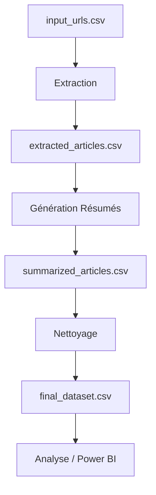

# 🦠 Système d'Extraction et d'Analyse d'Articles sur les Maladies Animales

> Application Python automatisée pour l'extraction, le traitement et l'analyse d'articles de presse multilingues sur les maladies animales, avec génération automatique de résumés et extraction d'informations structurées.

## 📋 Table des Matières

- [Vue d'ensemble](#vue-densemble)
- [Fonctionnalités](#fonctionnalités)
- [Architecture](#architecture)
- [Installation](#installation)
- [Configuration](#configuration)
- [Utilisation](#utilisation)
- [Structure des Données](#structure-des-données)
- [Technologies](#technologies)
- [Flux de Travail](#flux-de-travail)
- [Dépannage](#dépannage)

---

## 🎯 Vue d'ensemble

Ce projet est un système complet d'extraction et d'analyse d'articles de presse sur les maladies animales. Il permet de :

- **Extraire automatiquement** le contenu d'articles depuis des URLs
- **Détecter et traiter** plusieurs langues (Français, Anglais, Arabe)
- **Extraire des informations structurées** : maladies, animaux, lieux, dates, organismes
- **Générer des résumés multilingues** de différentes longueurs (50, 100, 150 mots)
- **Nettoyer et normaliser** les données pour l'analyse

### Cas d'usage

- Surveillance épidémiologique des maladies animales
- Veille sanitaire internationale
- Analyse de données pour tableaux de bord (Power BI, Excel)
- Recherche académique sur les maladies animales
- Collecte automatisée d'informations sanitaires

---

## ✨ Fonctionnalités

### 🔍 Extraction Automatique
- Extraction de contenu depuis des URLs (articles de presse, sites officiels)
- Détection automatique de la langue (Français, Anglais, Arabe)
- Extraction de métadonnées (titre, contenu, date de publication)
- Gestion des erreurs d'extraction (sites inaccessibles, pages protégées)

### 🌍 Multilingue
- **Français** : Traitement natif avec Ollama
- **Anglais** : Traitement natif avec Ollama
- **Arabe** : Traitement avec support RTL, traduction optionnelle

### 🤖 Intelligence Artificielle
- Utilisation d'**Ollama** (LLM local) pour l'extraction d'informations
- Génération de résumés contextuels multilingues
- Extraction intelligente d'entités nommées (maladies, animaux, lieux, organismes)
- Validation et nettoyage automatique des données

### 📊 Extraction d'Informations Structurées
- **Maladies** : Détection et normalisation (ex: "rage", "fièvre aphteuse", "dermatose nodulaire")
- **Animaux** : Identification des espèces concernées (bovins, ovins, volailles, etc.)
- **Lieux** : Extraction géographique (pays, régions, villes)
- **Dates** : Détection et normalisation des dates de publication
- **Organismes** : Identification des sources officielles (OMS, FAO, ministères, etc.)

### 📝 Génération de Résumés
- Résumés de **50 mots** : Vue d'ensemble concise
- Résumés de **100 mots** : Informations détaillées
- Résumés de **150 mots** : Contenu complet
- Génération parallèle pour performance optimale

### 🧹 Nettoyage de Données
- Remplacement des valeurs manquantes par "non détecté"
- Normalisation des erreurs ("unknown" → "non détecté")
- Gestion des erreurs d'extraction ("Erreur d'extraction" → "site inaccessible")
- Validation de la cohérence des données

---

## 🏗️ Architecture

### Structure du Projet

```
.
├── src/                          # Modules Python (code source)
│   ├── extraction_complete.py    # Module principal d'extraction
│   ├── resumes.py                # Module de génération de résumés
│   ├── ollama_client.py           # Client pour l'API Ollama
│   ├── translator.py             # Module de traduction
│   ├── prompts.py                # Gestionnaire de prompts pour LLM
│   └── utils.py                  # Fonctions utilitaires
│
├── scripts/                      # Scripts d'exécution
│   ├── run_extraction.py         # Script pour lancer l'extraction
│   ├── run_summaries.py          # Script pour générer les résumés
│   └── clean_data.py             # Script de nettoyage des données
│
├── config/                       # Configuration
│   ├── config_ia.py              # Configuration IA (Ollama, modèles)
│   └── data_constants.py          # Constantes et mappings de données
│
├── data/                         # Données (CSV)
│   ├── input_urls.csv            # URLs sources à traiter
│   ├── extracted_articles.csv    # Articles extraits avec métadonnées
│   ├── summarized_articles.csv   # Articles avec résumés générés
│   └── final_dataset.csv         # Dataset final nettoyé
│
├── docs/                         # Documentation
├── venv/                         # Environnement virtuel Python
├── requirements.txt              # Dépendances Python
└── README.md                     # Ce fichier
```

### Composants Principaux

#### 1. **NewsExtractor** (`src/extraction_complete.py`)
Classe principale pour l'extraction d'informations depuis les URLs :
- Extraction de contenu avec Trafilatura
- Détection de langue avec LangDetect
- Extraction de dates avec HTMLDate et DateParser
- Extraction d'entités avec Ollama (maladies, animaux, lieux, organismes)
- Validation et nettoyage du contenu

#### 2. **Résumés** (`src/resumes.py`)
Module de génération de résumés multilingues :
- Génération parallèle avec ThreadPoolExecutor
- Support multilingue (FR, EN, AR)
- Trois longueurs de résumés (50, 100, 150 mots)
- Gestion des erreurs et retry automatique

#### 3. **OllamaClient** (`src/ollama_client.py`)
Client pour interagir avec l'API Ollama :
- Détection automatique du modèle installé
- Gestion des timeouts et retry
- Support de différents modèles (phi3:mini, llama2, mistral, etc.)

#### 4. **PromptManager** (`src/prompts.py`)
Gestionnaire centralisé des prompts :
- Prompts pour extraction de dates
- Prompts pour extraction de maladies
- Prompts pour extraction d'animaux
- Prompts pour extraction de lieux
- Prompts pour extraction d'organismes

#### 5. **Utils** (`src/utils.py`)
Fonctions utilitaires :
- Nettoyage de contenu (suppression menus, publicités)
- Calcul de statistiques (caractères, mots)
- Validation de cohérence contenu/titre

---

## 🚀 Installation

### Prérequis

- **Python 3.10+** (recommandé : Python 3.10 ou 3.11)
- **Ollama** (pour l'IA locale) - [Télécharger](https://ollama.ai)
- **Git** (optionnel, pour cloner le projet)

### Étapes d'Installation

#### 1. Cloner ou télécharger le projet

```bash
# Si vous utilisez Git
git clone <url-du-repo>
cd <nom-du-projet>

# Ou simplement extraire l'archive ZIP
```

#### 2. Créer un environnement virtuel

```bash
# Windows
python -m venv venv
venv\Scripts\activate

# Linux/Mac
python3 -m venv venv
source venv/bin/activate
```

#### 3. Installer les dépendances

```bash
pip install -r requirements.txt
```

#### 4. Installer Ollama

1. Télécharger Ollama depuis [https://ollama.ai](https://ollama.ai)
2. Installer et lancer Ollama
3. Télécharger un modèle (recommandé : `phi3:mini` pour la rapidité)

```bash
# Modèles recommandés (du plus rapide au plus performant)
ollama pull phi3:mini      # ~2.2GB - Rapide et efficace ✅ RECOMMANDÉ
ollama pull llama3.2       # ~2GB - Équilibré
ollama pull llama2         # ~3.8GB - Plus performant
ollama pull mistral        # ~4.1GB - Très performant
```

#### 5. Vérifier l'installation

```bash
# Vérifier que Ollama fonctionne
ollama list

# Tester un modèle
ollama run phi3:mini "Bonjour"
```

---

## ⚙️ Configuration

### Configuration de l'IA (`config/config_ia.py`)

```python
# Activer/désactiver Ollama
USE_OLLAMA = True

# Modèle Ollama à utiliser
OLLAMA_MODEL = "phi3:mini"  # Modifier selon votre modèle installé
```

**Modèles recommandés :**
- `phi3:mini` : Rapide (~2.2GB), bon pour la production
- `llama3.2` : Équilibré (~2GB), bon compromis
- `llama2` : Performant (~3.8GB), meilleure qualité
- `mistral` : Très performant (~4.1GB), meilleure qualité

### Constantes de Données (`config/data_constants.py`)

Ce fichier contient :
- **Listes de lieux** : Pays, villes, régions (multilingue)
- **Dictionnaires d'animaux** : Mappings multilingues (FR, EN, AR)
- **Patterns de validation** : Regex pour extraction et validation
- **Mappings de traduction** : Correspondances entre langues

**Note** : Modifier ce fichier uniquement si vous souhaitez ajouter des lieux, animaux ou patterns personnalisés.

---

## 📖 Utilisation

### Préparation des Données

1. **Créer le fichier d'entrée** `data/input_urls.csv` :

```csv
Code,URL
code001,https://example.com/article1
code002,https://example.com/article2
code003,https://example.com/article3
```

**Format requis :**
- Colonne `Code` : Identifiant unique de l'article
- Colonne `URL` : URL de l'article à traiter

### Étape 1 : Extraction de Contenu

Extrait le contenu des articles depuis les URLs.

```bash
# Méthode recommandée (via script)
python scripts/run_extraction.py

# Méthode alternative (directement)
python src/extraction_complete.py
```

**Résultat :** Génère `data/extracted_articles.csv` avec :
- Titre, contenu, langue détectée
- Date de publication
- Maladie, animal, lieu, organisme (si détectés)
- Statistiques (caractères, mots)
- Erreurs éventuelles

**Durée estimée :** ~2-5 secondes par article (selon la complexité et le modèle Ollama)

### Étape 2 : Génération de Résumés

Génère les résumés multilingues pour chaque article.

```bash
# Méthode recommandée (via script)
python scripts/run_summaries.py

# Méthode alternative (directement)
python src/resumes.py
```

**Résultat :** Génère `data/summarized_articles.csv` avec :
- `resum_50` : Résumé de 50 mots
- `resum_100` : Résumé de 100 mots
- `resum_150` : Résumé de 150 mots

**Durée estimée :** ~3-10 secondes par article (selon le modèle Ollama et la longueur)

### Étape 3 : Nettoyage des Données (Optionnel)

Nettoie et normalise les données pour l'analyse.

```bash
python scripts/clean_data.py
```

**Résultat :** Génère `data/final_dataset.csv` avec :
- Valeurs manquantes remplacées par "non détecté"
- "unknown" remplacé par "non détecté"
- "Erreur d'extraction" remplacé par "site inaccessible"
- Données prêtes pour l'analyse

**Durée estimée :** < 1 seconde (très rapide)

---

## 📊 Structure des Données

### Fichier d'Entrée : `input_urls.csv`

```csv
Code,URL
code001,https://example.com/article1
code002,https://example.com/article2
```

### Fichier Intermédiaire : `extracted_articles.csv`

Colonnes principales :
- `Code` : Identifiant unique
- `URL` : URL source
- `Titre` : Titre de l'article
- `Contenu` : Contenu complet extrait
- `Langue` : Langue détectée (fr, en, ar)
- `Date_Publication` : Date au format YYYY-MM-DD
- `Lieu` : Lieu géographique détecté
- `Maladie` : Maladie détectée
- `Animal` : Animal concerné
- `Organisme` : Organisme source
- `Source` : Type de source (médias, site officiel)
- `Caracteres` : Nombre de caractères
- `Mots` : Nombre de mots
- `Erreur` : Message d'erreur si applicable

### Fichier avec Résumés : `summarized_articles.csv`

Contient toutes les colonnes de `extracted_articles.csv` plus :
- `resum_50` : Résumé de 50 mots
- `resum_100` : Résumé de 100 mots
- `resum_150` : Résumé de 150 mots

### Fichier Final : `final_dataset.csv`

Version nettoyée de `summarized_articles.csv` avec :
- Toutes les valeurs manquantes normalisées
- Erreurs d'extraction gérées
- Données prêtes pour l'analyse

---

## 🛠️ Technologies

### Bibliothèques Python Principales

- **pandas** : Manipulation et analyse de données
- **requests** : Requêtes HTTP pour Ollama
- **trafilatura** : Extraction de contenu web
- **beautifulsoup4** : Parsing HTML
- **langdetect** : Détection automatique de langue
- **htmldate** : Extraction de dates depuis HTML
- **dateparser** : Parsing flexible de dates
- **transformers** : Modèles NLP (optionnel, pour résumés avancés)
- **torch** : Backend pour transformers
- **tqdm** : Barres de progression

### Intelligence Artificielle

- **Ollama** : LLM local pour extraction et résumés
  - Modèles supportés : phi3:mini, llama2, llama3.2, mistral
  - API REST locale (http://localhost:11434)
  - Gratuit et sans limite d'utilisation

### Outils d'Extraction

- **Trafilatura** : Extraction de contenu principal (article)
- **BeautifulSoup** : Parsing HTML avancé
- **HTMLDate** : Extraction de dates depuis métadonnées HTML
- **DateParser** : Parsing flexible de dates multilingues

---

## 🔄 Flux de Travail



### Processus Détaillé

1. **Input** : Fichier CSV avec URLs
2. **Extraction** :
   - Récupération du contenu depuis chaque URL
   - Détection de la langue
   - Extraction de métadonnées (date, titre)
   - Extraction d'entités avec Ollama (maladie, animal, lieu, organisme)
3. **Résumés** :
   - Génération de 3 résumés par article (50, 100, 150 mots)
   - Traitement parallèle pour performance
4. **Nettoyage** :
   - Normalisation des valeurs manquantes
   - Gestion des erreurs
   - Validation de cohérence
5. **Output** : Dataset final prêt pour l'analyse

---

## 🔧 Dépannage

### Problèmes Courants

#### Ollama ne répond pas

```bash
# Vérifier que Ollama est lancé
ollama list

# Redémarrer Ollama
# Windows : Redémarrer le service Ollama
# Linux/Mac : ollama serve
```

#### Erreur "Model not found"

```bash
# Vérifier les modèles installés
ollama list

# Installer le modèle configuré
ollama pull phi3:mini
```

#### Erreurs d'extraction fréquentes

- Vérifier la connectivité internet
- Certains sites peuvent bloquer les scrapers
- Vérifier que les URLs sont accessibles manuellement

#### Performance lente

- Utiliser un modèle plus rapide (`phi3:mini` au lieu de `llama2`)
- Réduire le nombre de workers dans `resumes.py` (MAX_WORKERS)
- Vérifier les ressources système (RAM, CPU)

#### Problèmes de mémoire

- Réduire MAX_WORKERS dans `resumes.py`
- Utiliser un modèle plus petit (`phi3:mini`)
- Traiter les données par lots

### Logs et Debugging

Les scripts affichent des messages de progression :
- `[OK]` : Succès
- `[ATTENTION]` : Avertissement (non bloquant)
- `[ERREUR]` : Erreur (bloquant)

Pour plus de détails, consulter les messages dans la console.

---

## 📝 Notes Importantes

### Limitations

- **Dépendance Ollama** : Nécessite Ollama installé et lancé localement
- **Performance** : La vitesse dépend du modèle Ollama utilisé
- **Extraction** : Certains sites peuvent bloquer les scrapers
- **Langues** : Support optimal pour FR, EN, AR. Autres langues avec détection automatique

### Bonnes Pratiques

1. **Tester avec un petit échantillon** avant de traiter de grandes quantités
2. **Sauvegarder régulièrement** les fichiers intermédiaires
3. **Vérifier la qualité** des extractions avant de générer les résumés
4. **Utiliser un modèle adapté** à vos besoins (rapidité vs qualité)

### Support

Pour toute question ou problème :
1. Vérifier la section [Dépannage](#dépannage)
2. Consulter les logs d'erreur
3. Vérifier la configuration dans `config/config_ia.py`

---

## 📄 Licence

[À compléter selon votre licence]

---

## 👥 Auteurs

[À compléter]

---

## 🙏 Remerciements

- **Ollama** pour l'infrastructure LLM locale
- **Trafilatura** pour l'extraction de contenu
- **Communauté Python** pour les excellentes bibliothèques

---

**Dernière mise à jour :** Décembre 2025
